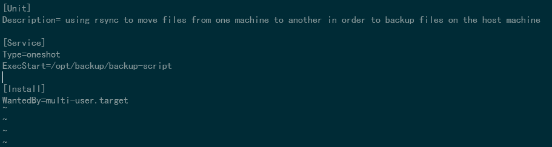

# How to backup files with rsync in a service

### Creating your script

Put your shebang header to ensure the script can be read properly
Using rsync we can pick the directory we would like to back up.
The syntax follows as 

```
    rsync [options] [src] [user@]host-ip:[destination]
```

This will allow you to copy files from the source directory, into the host-ip, then into
the specified directory in [destination]

To get the script to read a config file that contains all your variables, such as directories to backup or the IP destination you would like to back up to, you source the file like so:

```
    . ./backup-script.conf # this sources the config file
```

With something resembling this inside the config file:

```
    IPADD=164.92.115.237
    DIR="./backup-files ./randir"
```
Your script should look something similar to this, it will differ based on options you run:


### Creating service file

In a service file, we will add in [Unit] to put in a description of the script/service
Following that, we will add in [Service], this is to specify the type, and where it will
execute from
The type will be oneshot and it will execute from
 
```
    Type=oneshot
    ExecStart=/opt/backup/backup-script
```

Finally we will add in [Install], under install we will put in 
	
```
    [Install]
    WantedBy=multi.user.target
```

By the end, your file should resember something similar to this:


### Creating timer file


Here we will create the timer file that lets us the service be executed every Friday at 01:00:00
Like the service file we will have [Unit] to describe the timer
[Timer] will let us specify the parameters at which the timer will go off
We want it to execute every Friday 01:00:00, so we will use 

```
    [Timer]
    OnCalendar=Fri 13:00:00
    Persistent=true
```
 to ensure that it will be ran the next time the machine is booted if it is off during the timer.

Your timer file should look like this:


Made by: Benny Cao & Christina Yin
